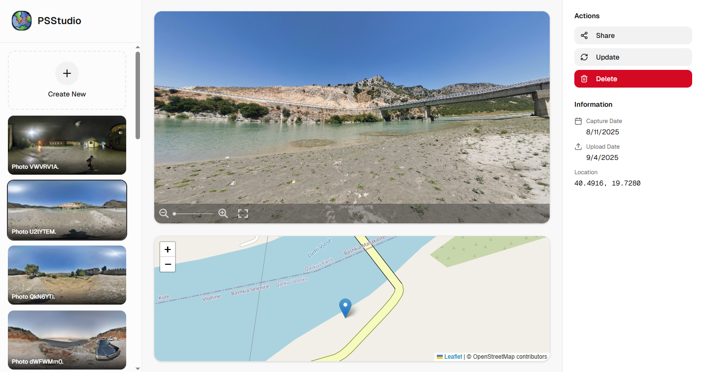
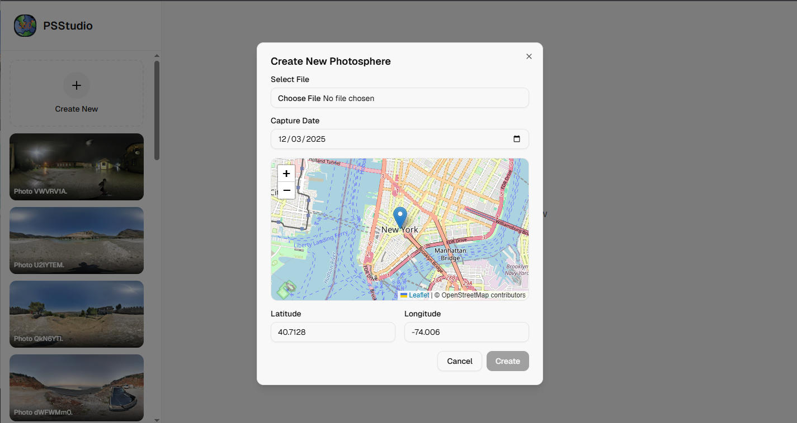

# PSStudio

**PSStudio** is a professional management tool for Google Street View Photospheres. It provides a streamlined interface for uploading, editing, and managing your 360° photos on Google Maps.


*Dashboard View*


*Upload PhotoSphere View*

## Features

-   **Google OAuth Integration**: Securely log in with your Google account to access your Street View content.
-   **Photosphere Management**:
    -   **Upload**: Easily upload 360° photos with metadata.
    -   **List**: View all your published photospheres in a grid layout.
    -   **View**: Interactive 360° viewer to inspect your photos.
    -   **Edit Location**: Update the GPS coordinates (latitude/longitude) of your photospheres using an interactive map.
    -   **Delete**: Remove photospheres from Google Street View.
-   **Map Integration**: Visual map editor for precise location adjustments.
-   **Toast Notifications**: Real-time feedback for all actions using `react-hot-toast`.

## Tech Stack

-   **Framework**: [Next.js](https://nextjs.org/) (App Router)
-   **Language**: TypeScript
-   **Styling**: [Tailwind CSS](https://tailwindcss.com/)
-   **UI Components**: [Radix UI](https://www.radix-ui.com/) / [shadcn/ui](https://ui.shadcn.com/)
-   **Maps**: [Leaflet](https://leafletjs.com/) with [React Leaflet](https://react-leaflet.js.org/)
-   **Authentication**: Google OAuth 2.0
-   **State Management**: React Hooks
-   **Icons**: [Lucide React](https://lucide.dev/)

## Getting Started

### Prerequisites

-   Node.js (v20 or higher)
-   npm
-   A Google Cloud Platform project with the **Street View Publish API** enabled.

### Installation

1.  Clone the repository:
    ```bash
    git clone https://github.com/2xxn/psstudio.git
    cd psstudio
    ```

2.  Install dependencies:
    ```bash
    npm install
    ```

3.  Set up environment variables:
    Create a `.env.local` file in the root directory and add the following variables:

    ```env
    # Google OAuth Credentials
    X_CLIENT_ID=your_google_client_id
    X_CLIENT_SECRET=your_google_client_secret
    REDIRECT_URI=http://localhost:3000/api/auth/callback

    # Encryption Key (32 bytes for AES-256)
    CBC_KEY=your_32_byte_random_string

    # Optional
    NEXT_PUBLIC_API_URL=/api
    ```

### Running the Application

Run the development server:

```bash
npm run dev
```

Open [http://localhost:3000](http://localhost:3000) with your browser to see the result.

## Deployment

To build the application for production:

```bash
npm run build
npm start
```

## License

This project is licensed under the MIT License - see the [LICENSE](LICENSE) file for details.
